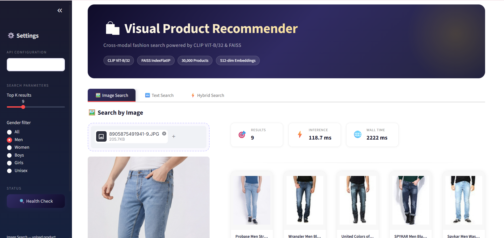
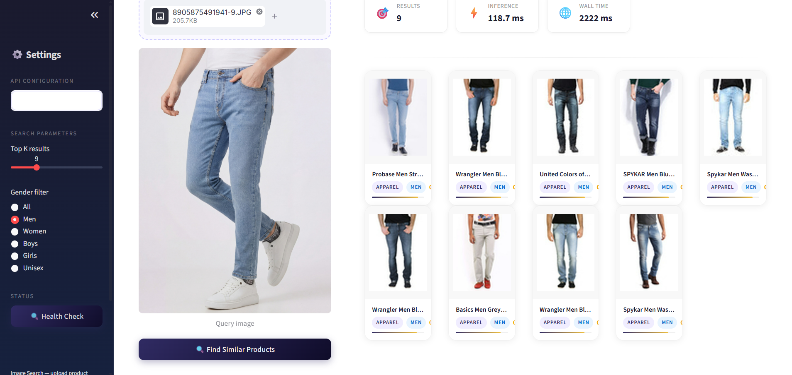
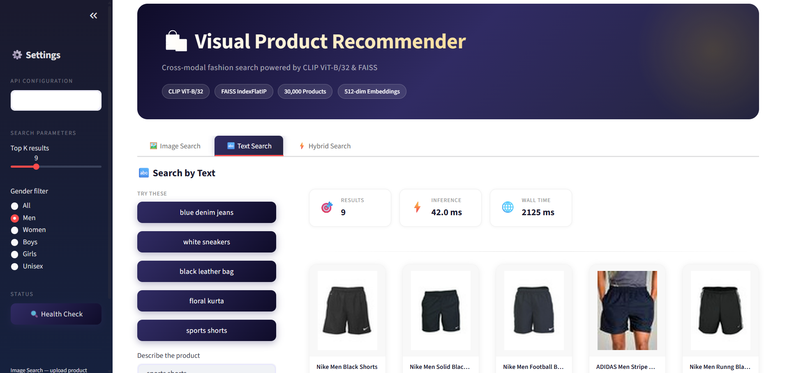
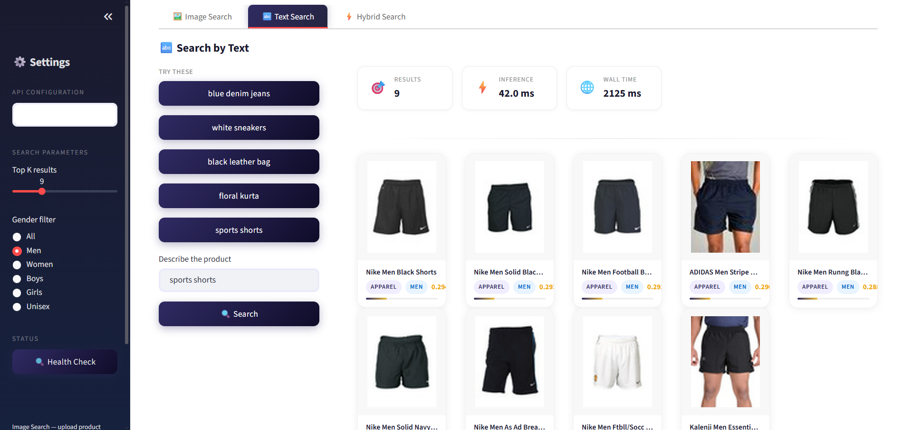
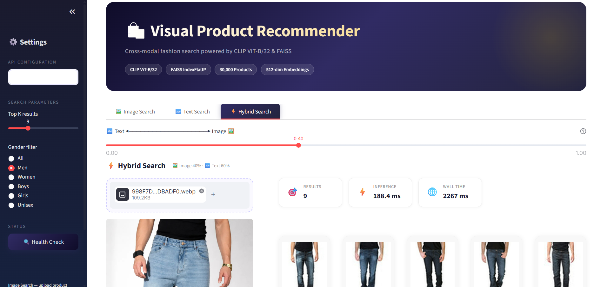
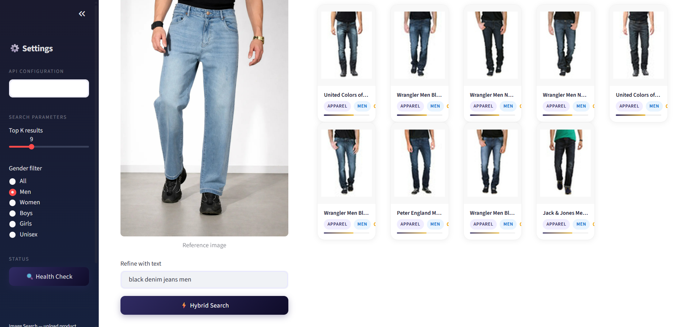

# Visual Product Recommendation System

> Cross-modal fashion search powered by **CLIP ViT-B/32** + **FAISS IndexFlatIP**.
> Upload an image, type a description, or combine both — the system finds visually and semantically similar products in milliseconds.

---

## Screenshots

### Image Search — upload any product photo, find visually similar items



### Text Search — natural language queries with quick-suggestion buttons



### Hybrid Search — fuse image + text with adjustable alpha slider



---

## What This Project Does

Most e-commerce search relies on keyword matching — users type "blue shirt" and get results based on product tags. This system replaces keyword search with **semantic understanding**:

- Search by **uploading a product image** → CLIP encodes it into a 512-d vector → FAISS finds the closest product vectors
- Search by **typing natural language** → "red floral summer dress" → CLIP maps text to the same embedding space as images → same FAISS search
- Search **both at once (hybrid)** → image vector × 0.6 + text vector × 0.4, fused and re-normalized → best of both modalities

No manual tagging. No keyword rules. No category filters required.

---

## Tech Stack

| Layer | Technology | Why |
|-------|-----------|-----|
| **Embedding model** | CLIP ViT-B/32 (OpenAI) | Shared image+text embedding space — one model handles both modalities |
| **Vector index** | FAISS IndexFlatIP | Exact cosine similarity search; sub-millisecond at 30K vectors |
| **Backend API** | FastAPI + Uvicorn | Async, production-grade REST API with auto docs at `/docs` |
| **Frontend** | Streamlit | Rapid ML UI with custom CSS for premium design |
| **Experiment tracking** | MLflow (SQLite backend) | Logs every request: latency, query type, result count |
| **Dataset** | Fashion Product Images (Kaggle) | 44K real fashion products with metadata |
| **GPU acceleration** | PyTorch + CUDA 11.8 | CLIP inference on RTX 2050: ~130ms vs ~280ms on CPU |
| **Environment** | Anaconda (Python 3.13) | Isolated, reproducible environment |

---

## Architecture

```
╔══════════════════════════════════════════════════════════════════════╗
║                        USER  (Browser)                               ║
║                     Streamlit  :8501                                 ║
║                                                                      ║
║   ┌──────────────┐   ┌──────────────┐   ┌──────────────────────┐   ║
║   │ Image Search │   │  Text Search │   │    Hybrid Search     │   ║
║   │  upload img  │   │  type query  │   │  img + text + alpha  │   ║
║   └──────┬───────┘   └──────┬───────┘   └──────────┬───────────┘   ║
╚══════════╪══════════════════╪══════════════════════╪════════════════╝
           │  HTTP multipart  │  HTTP form           │  HTTP multipart+form
╔══════════▼══════════════════▼══════════════════════▼════════════════╗
║                      FastAPI  :8000                                  ║
║                                                                      ║
║   ┌─────────────────────────────────────────────────────────────┐   ║
║   │                  CLIP ViT-B/32  (GPU/CPU)                   │   ║
║   │                                                             │   ║
║   │  encode_image(PIL)  ──►  512-d float32 vector              │   ║
║   │  encode_text(str)   ──►  512-d float32 vector              │   ║
║   │  hybrid fusion      ──►  α·img + (1-α)·txt → normalize     │   ║
║   └───────────────────────────┬─────────────────────────────────┘   ║
║                               │ L2-normalized 512-d vector           ║
║   ┌───────────────────────────▼─────────────────────────────────┐   ║
║   │              FAISS IndexFlatIP  (30K vectors)               │   ║
║   │                                                             │   ║
║   │  index.search(vec, top_k)  →  scores + indices  <1ms       │   ║
║   └───────────────────────────┬─────────────────────────────────┘   ║
║                               │ product IDs                          ║
║   ┌───────────────────────────▼─────────────────────────────────┐   ║
║   │         styles.csv  (pandas DataFrame, indexed by id)       │   ║
║   │  → product_name · category · gender · colour · articleType  │   ║
║   └─────────────────────────────────────────────────────────────┘   ║
║                                                                      ║
║   ┌──────────────────────────────────────────────────────────────┐  ║
║   │  MLflow Logger  (SQLite)  — logs every request               │  ║
║   │  latency_ms · query_type · top_k · result_count              │  ║
║   └──────────────────────────────────────────────────────────────┘  ║
╚══════════════════════════════════════════════════════════════════════╝
           │
╔══════════▼══════════════════════════════════════════════════════════╗
║                       Artifacts  (disk)                              ║
║                                                                      ║
║   embeddings.npy          — (30000 × 512) float32 numpy array       ║
║   product_index.faiss     — FAISS binary index (~58 MB)             ║
║   image_ids.json          — ordered list of product IDs             ║
╚══════════════════════════════════════════════════════════════════════╝
```

---

## How CLIP Works Here

```
          IMAGE PATH                         TEXT PATH
              │                                  │
    ┌─────────▼──────────┐           ┌───────────▼──────────┐
    │   PIL Image (RGB)  │           │   Tokenize string    │
    │  224×224 resize    │           │  (BPE, max 77 tok)   │
    └─────────┬──────────┘           └───────────┬──────────┘
              │                                  │
    ┌─────────▼──────────────────────────────────▼──────────┐
    │              CLIP ViT-B/32  (86M params)               │
    │  Vision Transformer (image) + Text Transformer (text)  │
    │      Both project to SAME 512-dimensional space        │
    └─────────────────────────┬──────────────────────────────┘
                              │
                   L2-normalize vector
                              │
                    ┌─────────▼─────────┐
                    │  cosine similarity │  ← dot product on normalized vecs
                    │   via FAISS FlatIP │
                    └───────────────────┘
```

**Key insight:** CLIP was trained on 400M image-text pairs. It learned that a photo of a blue dress and the text "blue dress" should be close in embedding space. This makes zero-shot cross-modal retrieval possible — no fine-tuning needed.

---

## Hybrid Search — How Fusion Works

```python
img_vec  = clip.encode_image(image)    # (1, 512) normalized
txt_vec  = clip.encode_text(query)     # (1, 512) normalized

fused    = alpha * img_vec + (1 - alpha) * txt_vec
fused    = faiss.normalize_L2(fused)   # re-normalize after fusion

results  = faiss_index.search(fused, top_k)
```

| Alpha | Image % | Text % | Use case |
|-------|---------|--------|----------|
| 0.0 | 0% | 100% | Pure text search |
| 0.3 | 30% | 70% | Color/style refinement |
| 0.6 | 60% | 40% | Default — shape from image, detail from text |
| 1.0 | 100% | 0% | Pure visual similarity |

---

## Dataset

**Fashion Product Images** — Kaggle (`paramaggarwal/fashion-product-images-small`)

| Field | Value |
|-------|-------|
| Total images | 44,441 |
| Indexed | 30,000 |
| Metadata | `styles.csv` — id, gender, masterCategory, subCategory, articleType, baseColour, season, usage, productDisplayName |
| Image size | 60 × 80 px (JPEG) |
| License | CC0 Public Domain |
| Genders | Men, Women, Boys, Girls, Unisex |
| Categories | Apparel, Footwear, Accessories, Personal Care, Sporting Goods |

---

## How to Run

### 1. Set up environment

```bash
conda activate bespin_env2
pip install faiss-cpu mlflow git+https://github.com/openai/CLIP.git python-multipart
```

### 2. Download dataset

```bash
kaggle datasets download -d paramaggarwal/fashion-product-images-small
unzip fashion-product-images-small.zip -d data/fashion-dataset/
```

### 3. Generate embeddings (GPU auto-detected)

```bash
python models/embeddings.py
# → artifacts/embeddings.npy  (30000 × 512)
# → artifacts/image_ids.json
```

### 4. Build FAISS index

```bash
python models/build_index.py
# → artifacts/product_index.faiss  (~58 MB)
```

### 5. Start FastAPI backend

```bash
uvicorn api.main:app --host 0.0.0.0 --port 8000
# → http://localhost:8000/docs  (Swagger UI)
```

### 6. Start Streamlit frontend

```bash
streamlit run app/streamlit_app.py
# → http://localhost:8501
```

### 7. Run evaluation

```bash
python evaluation/evaluate.py
# → prints P@10 + latency table
# → saves evaluation/evaluation_results.json
```

### One-shot

```bash
bash run.sh
```

---

## API Documentation

### GET /health
```bash
curl http://localhost:8000/health
```
```json
{"status": "ok", "model_loaded": true, "index_size": 30000, "device": "cuda"}
```

### POST /recommend/image
```bash
curl -X POST http://localhost:8000/recommend/image \
  -F "file=@shirt.jpg" \
  -G -d "top_k=10&gender=Men"
```
```json
[
  {
    "product_id": "15970",
    "product_name": "Highlander Men Navy Blue Slim Jeans",
    "image_path": "images/15970.jpg",
    "category": "Apparel",
    "gender": "Men",
    "similarity_score": 0.934,
    "inference_latency_ms": 130.5
  }
]
```

### POST /recommend/text
```bash
curl -X POST http://localhost:8000/recommend/text \
  -F "query=black slim fit jeans" \
  -F "top_k=10" \
  -F "gender=Men"
```

### POST /recommend/hybrid
```bash
curl -X POST http://localhost:8000/recommend/hybrid \
  -F "file=@jeans.jpg" \
  -F "query=black denim jeans" \
  -F "top_k=10" \
  -F "alpha=0.4" \
  -F "gender=Men"
```
`alpha` — image weight (0.0 = pure text, 1.0 = pure image, default 0.6)

### GET /product/{product_id}
```bash
curl http://localhost:8000/product/15970
```

---

## Performance Metrics

### Retrieval Quality — `evaluation/evaluate.py` (20 queries, 30K index)

| Query Type | Avg P@10 | Avg Category Consistency | Avg Latency |
|------------|----------|--------------------------|-------------|
| Text (10 queries) | **1.00** | **1.00** | 50.5 ms |
| Image (10 queries) | **0.77** | **0.77** | 75.6 ms |
| **Overall** | **0.89** | **0.89** | **63.0 ms** |

Text search achieves perfect P@10 across all 10 queries (dresses, jeans, sneakers, handbags, suits, etc.).
Image search scores 1.00 on core fashion categories (Apparel, Footwear, Accessories). Lower scores on edge-case categories (Home, Free Items) that fall outside the fashion distribution CLIP was optimized for.

### Inference Latency

| Metric | CPU | GPU (RTX 2050) |
|--------|-----|----------------|
| Model | CLIP ViT-B/32 | CLIP ViT-B/32 |
| Index | FAISS IndexFlatIP | FAISS IndexFlatIP |
| Dataset | 30,000 products | 30,000 products |
| Embedding dim | 512 | 512 |
| FAISS search latency | < 1 ms | < 1 ms |
| Image encode latency | ~280 ms | ~130 ms |
| Text encode latency | ~120 ms | ~42 ms |
| Hybrid latency | ~400 ms | ~185 ms |
| GPU cold start | — | ~1086 ms (first request only, warmup pass eliminates this) |
| GPU warm (subsequent) | — | ~130 ms |

---

## Business Use Case

E-commerce platforms lose revenue when customers cannot find what they want. Traditional keyword search breaks when users can't describe products precisely. This system solves three real scenarios:

1. **"I saw this online, find me something similar"** → Image Search
   Upload a screenshot or photo, get visually similar products instantly

2. **"I want something like this but in a different color"** → Hybrid Search
   Upload the reference product + type the color/style change, adjust alpha to control which signal dominates

3. **"Show me casual blue shirts for men"** → Text Search + Gender Filter
   Natural language understood by CLIP, no keyword tags needed

**Scaling path:** At 30K products, IndexFlatIP is exact and fast. At 1M+ products, swap to `IndexIVFFlat` (approximate, 10× faster) or `IndexHNSWFlat` (graph-based, best recall) — FAISS makes this a one-line change.

---

## MLflow Tracking

```bash
mlflow ui --port 5000
# → http://localhost:5000 → experiment "visual-recommender"
```

| Logged at | Parameter / Metric |
|-----------|-------------------|
| Startup | model_name, index_type, embedding_dim, dataset_size |
| Per request | query_type, top_k, latency_ms, result_count |

---

## Project Structure

```
visual-recommendation-system/
├── data/fashion-dataset/
│   ├── images/                ← 44K product images (.jpg)
│   └── styles.csv             ← product metadata (44 columns)
├── models/
│   ├── embeddings.py          ← CLIP batch encoding pipeline (GPU/CPU)
│   └── build_index.py         ← FAISS IndexFlatIP builder
├── api/
│   └── main.py                ← FastAPI: 5 endpoints, lifespan, MLflow
├── app/
│   └── streamlit_app.py       ← Premium Streamlit UI (custom CSS)
├── evaluation/
│   └── evaluate.py            ← P@10 + category consistency + latency
├── utils/
│   └── mlflow_logger.py       ← MLflow SQLite logger (thread-safe)
├── artifacts/
│   ├── embeddings.npy         ← (30000 × 512) float32
│   ├── image_ids.json         ← ordered product ID list
│   └── product_index.faiss    ← FAISS binary index (~58 MB)
├── docs/screenshots/          ← UI screenshots for README
├── requirements.txt
├── run.sh
└── README.md
```
